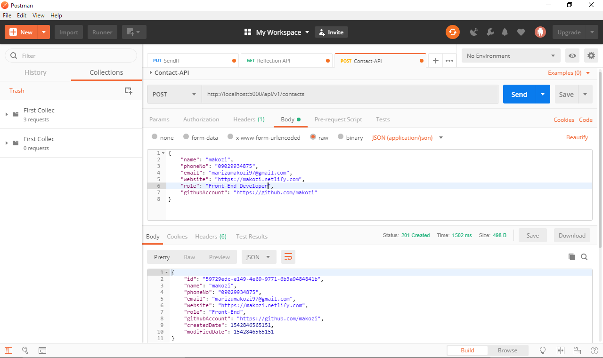
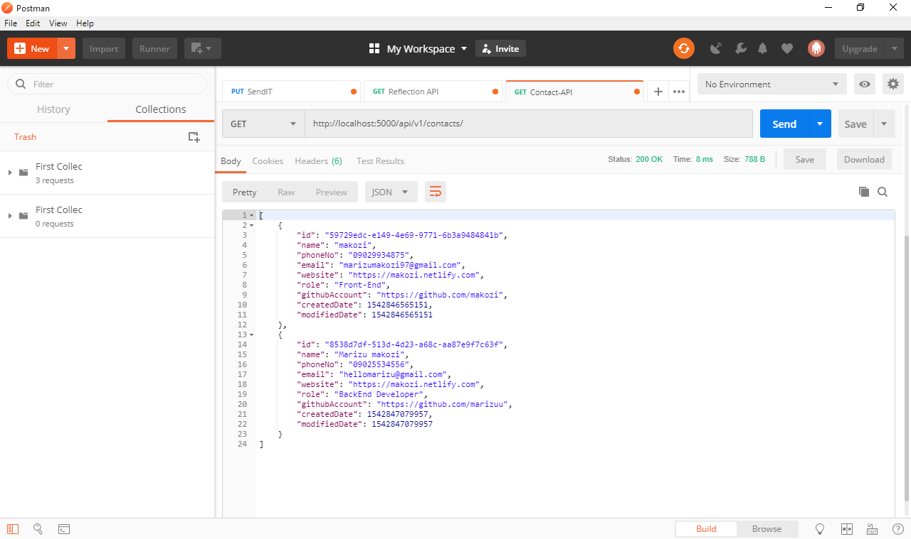
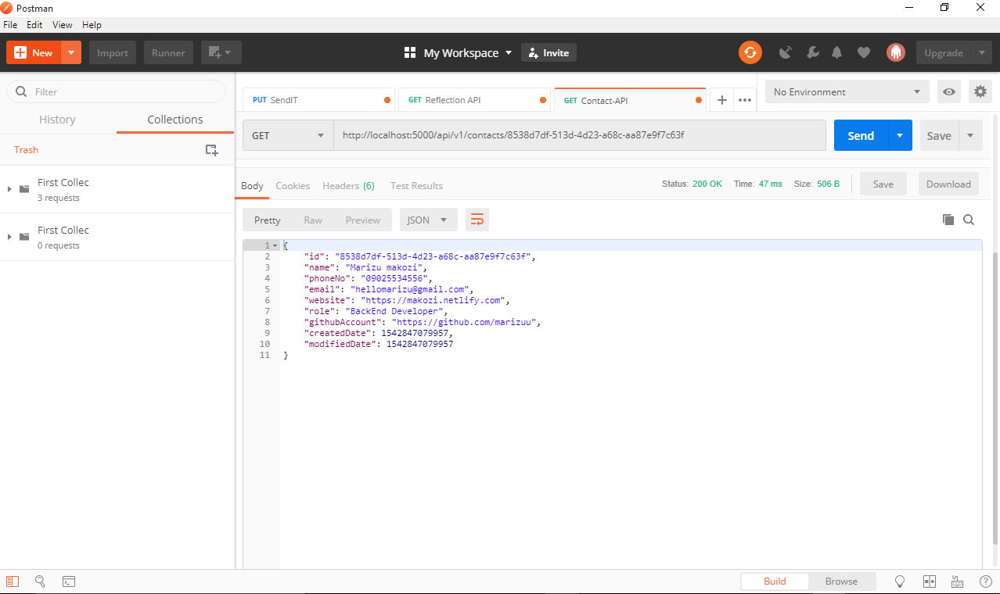
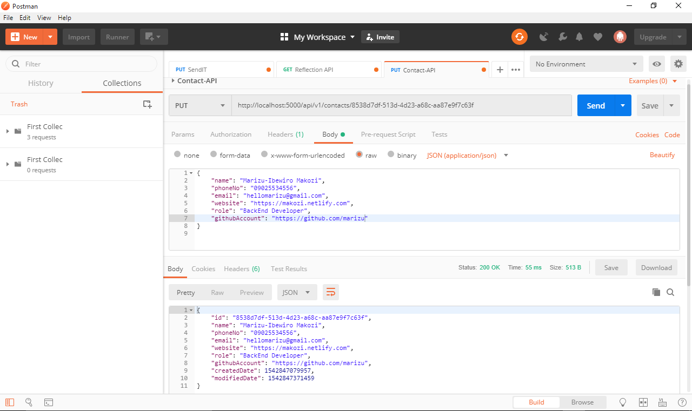

# Contact-API


An API for developers Contact Directory


[](https://codeclimate.com/github/makozi/Contact-API/maintainability)


## Getting Started
Instructions to get the project running successfully.

## Prerequisites
You need to have these installed before cloning the project
* NodeJS (At least v8.11.2) - https://nodejs.org/en/download/


## Technologies Used
- [Eslint](https://eslint.org/)
- [Nodejs](https://nodejs.org/en/)
- [Express](https://expressjs.com/)
- [Code-Climate](https://codeclimate.com/)
- [Babel](https://babeljs.io/)


## Installation

```bash
git clone https://github.com/makozi/Contact-API.git
```

```bash
cd Contact-API
```

```bash
npm install
```

```bash
npm start
```

## Test

Testing is used at key checkpoints in the overall process to determine whether objectives are being met. It also speed up software development process

## Test Tool
- [Mocha](https://mochajs.org/)


##### Server side tests

```bash
npm run test
```


```bash
npm run lint:dev
```

<h3>ENDPOINTS</h3>
<hr>
<table>
  <tr>
      <th>Request</th>
      <th>End Point</th>
      <th>Action</th>
  </tr>
  <tr>
      <td>POST</td>
      <td>/api/v1/contacts</td>
      <td>Create a new contact</td>
  </tr>

  <tr>
      <td>GET</td>
      <td>/api/v1/contacts</td>
      <td>Get all contacts</td>
  </tr>
  <tr>
        <td>GET</td>
        <td>/api/v1/contacts/:id</td>
        <td>Get a contact by contactid</td>
  </tr>
   <tr>
      <td>PUT</td>
      <td>/api/v1/contacts/:id</td>
      <td>Update a contact by contactid</td>
  </tr>
 
  <tr>
        <td>DELETE</td>
        <td>/api/v1/contacts/:id</td>
        <td>Delete contact by contactid</td>
  </tr>

   
  
  

</table>
<br>

##### Testing Endpoints in POSTMAN

## Create A Contact



## Get All Contacts



## Get A  Contact



## Update A  Contact




## Author
[Marizu-Ibewiro Makozi](https://makozi.netlify.com)

